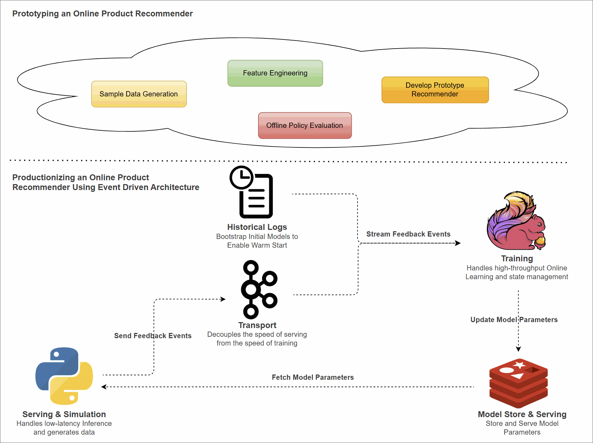

# Productionizing an Online Product Recommender using Event Driven Architecture

A two-part write-up on building an end-to-end online product recommender, from experimental validation to a production-ready event-driven system.

Many contextual bandit resources focus on the algorithm in isolation. Very few walk through the full journey: data generation, offline evaluation, live simulation, and streaming production architecture.

This series aims to close that gap.

- [Prototyping an Online Product Recommender in Python](https://jaehyeon.me/blog/2026-01-29-prototype-recommender-with-python/): Traditional recommendation systems often struggle with cold-start users and with incorporating immediate contextual signals. In contrast, Contextual Multi-Armed Bandits, or CMAB, learn continuously in an online setting by balancing exploration and exploitation using real-time context. In Part 1, we develop a Python prototype that simulates user behavior and validates the algorithm, establishing a foundation for scalable, real-time recommendation systems.
- [Productionizing an Online Product Recommender using Event Driven Architecture](https://jaehyeon.me/blog/2026-02-23-productionize-recommender-with-eda/): While effective for testing algorithms locally, a monolithic script cannot handle production scale. Real-world recommendation systems require low-latency inference for users and high-throughput training for model updates. This post demonstrates how to decouple these concerns using an event-driven architecture with Apache Flink, Kafka, and Valkey.



## Quick start

Infrastructure is provisioned with [odctl](https://github.com/jaehyeon-kim/odctl), installed from `requirements.txt`. Docker and a JDK 17 toolchain are required.

```bash
# from the repository root
uv venv --python 3.11 venv && source venv/bin/activate
uv pip install -r product-recommender/requirements.txt

cd product-recommender
odctl init
python recsys-engine/prepare_data.py
(cd recsys-trainer && ./gradlew shadowJar)

odctl up kafka-lite flink-full valkey
./submit-job.sh
python recsys-engine/eda_recommender.py
```

Flink UI is at `:8082`, Kafka UI at `:8086`. Tear down with `odctl down kafka-lite flink-full valkey`.
